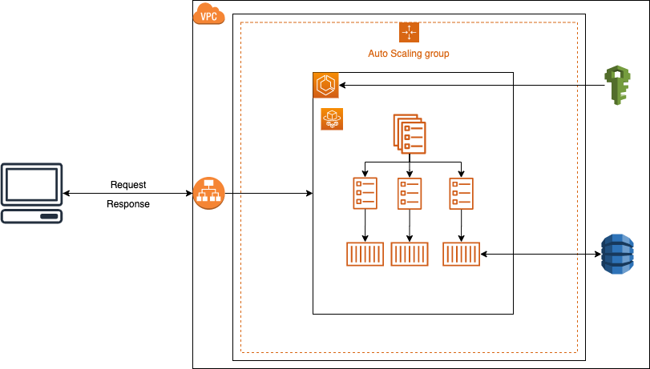

# ip geo localization

## Descripción

Esta es una aplicación que tiene como propósito obtener la información asociada a una dirección ip dada,
además de proveer estadisticas de consumo de la aplicación de acuerdo al pais asociado a las ip consultadas.

## Implementación

Es una aplicación (API REST) desarrollada en Java 11, construida como proyecto Maven y haciendo uso del framework de 
desarrollo Spring Boot 2.5.1

La aplicación cuenta con 2 endpoint REST:

- /trace (POST):
    Recibe como body de la petición un objeto JSON que debe tener una propiedad llamada ip, la cual hace referencia
    a la dirección IP a la cual se le desea consultar información asociada al pais al que pertenece.
    
- /stats (GET):
    No recibe parametros y retorna estadisticas asociadas a las IP consultadas en el endpoint /trace.
    
## Versiones

La aplciación cuenta con 2 versiones para el registro y obtención de las estadisticas de uso de la aplicación:

- Local: Se realiza un almacenado y procesamiento de las estadisticas a nivel local con uan estructura de datos 
en memoria, es decir, para esta versión de la aplicación el registro de estadisticas se perderá cada que haya un
shutdown de la aplicación.

- Dynamo:  Se realiza un almacenado y procesamiento de las estadisticas en una tabla de Dynamo en AWS, por lo cual,
ante un posible shutdown de la aplicación no se perderá el registro de las estadisticas y luego de restablecida la
aplicación al consultar las estadisticas se obtendrá la información de acuerdo al historico de uso de la aplicación
sin sufrir perdida de información.

## Ejecución

Existen 2 maneras de ejecutar la aplciación en ambiente local, aunque las 2 formas implican correr una imagen docker 
de la aplciación, es decir, el resultado final será un contenedor docker ejecutando la aplicación.  

**Prerrequisitos**  
    - Java  
    - Git  
    - Docker  
    - Maven

1. Descargar imagen docker:  
    -  Descargar la imagen docker:  
        `docker pull jonnysotomonte/ip-geo-localization-local:latest`
    -  Levantar contenedor:  
        `docker docker run -e IPAPI_ACCESS_KEY='7bd942b4b5df8d66082ff5eb8c0aeded' -e FIXER_ACCESS_KEY='4e806e644979edf84bf11838fc291bdf' -p 80:8080 --name ip-geo-localization-local ip-geo-localization-local:latest`
    -  Consumir aplicación apuntando a localhost:  
       `curl -X POST -d "{'ip':'83.44.196.93'}" "http://localhost:8080/trace"`  
       `curl -X GET "http://localhost:8080/stats"`

2. Construir imagen docker:
    - Clonar repositorio actual:  
    `git clone https://github.com/jonnySotomonte/ipGeolocalization.git`  
    - Posicionarse en carpeta del proyecto:  
    `cd ipGeolocalization` 
    -  Cambiarse a la rama llamada **local**:  
    `git checkout local`
    - Contruir proyecto Java:  
    `mvn install && mvn package`
    - Construir imagen docker:  
    `docker build -t ip-geo-localization:latest .`  
    -  Levantar contenedor:  
       `docker docker run -e IPAPI_ACCESS_KEY='7bd942b4b5df8d66082ff5eb8c0aeded' -e FIXER_ACCESS_KEY='4e806e644979edf84bf11838fc291bdf' -p 80:8080 --name ip-geo-localization-local ip-geo-localization-local:latest`
    -  Consumir aplicación apuntando a localhost:  
       `curl -X POST -d "{'ip':'83.44.196.93'}" "http://localhost:8080/trace"`  
       `curl -X GET "http://localhost:8080/stats"`
  
  Para no hacer llamados innecesarios a las API externas y así evitar consumir el limite 
  de llamados permitidos y a su vez mejorar los tiempos de respuesta de la aplicación se ha
  hecho uso de un cahce en memoria que al detectar invocaciones para peticiones que anteriormente
  ya se habian realizado no consumirá las API's externas sino que retornara la respuesta ya almacenada
  en la memoria.
    
## Despliegue

1.  La plicación tambien se encuentra desplegada en la nube de AWS siendo ejecutada como contenedor Docker,
haciendo uso del servicio Elastic Container Service (ECS) bajo una arquitectura Serverless en instancias tipo Fargate.  

2.  La aplicación tiene asociado un Log Group de Cloudwatch en el cual se puede evidenciar el registro de los logs 
generados por la aplciación, con el próposito de evidenciar el paso a paso de cada una de las peticiones realizadas,
así como el registro de los errores que se puedan presentar dentro de la ejecución de la misma.  

3.  El servicio ECS tiene configurado mediante Roles y Politicas de IAM permisos de Lectura y Escritura sobre una tabla de DynamoDB
para realizar el registro de las distancias de cada uno de los paises asociados a las IP consultadas y cuantas invocaciones
por país se han realizado sobre la aplicación, para posteriormente obtener las estadisticas solicitadas.  

4.  A manera de propuesta para soportar una fluctuación pesada en las peticiones que puede llegar a recibir la aplciación
se opta por configurar al servicio ECS un Application Load Balancer (ALB) + Auto Scaling Group (ASG) los cuales se encargaran
de distribuir la carga entre las diferentes instancias que estén disponible en cada momento, asi como de crear o destruir instancias
dependiendo de las metricas de consumo de recursos que tengan en un momento dado las instancias que se estén ejecutando.  
*Nota: Esta implementación es sugerida y aún no se encuentra implementada*

5.  En la siguiente imagen se puede observar el diagrama de Arquitectura propuesto y descrito anteriormente  

## Convenciones de código

Este proyecto usa el formato para Java de Google: el cual puede ser consultado en el siguiente enlace https://github.com/google/styleguide 
para obtener la configuración correspondiente a su IDE de preferencia.

Para archivos no-Java por favor seguir las siguientes convenciones. Por ejemplo:

- Usar espacios en vez de tabs.
- No hacer commit de archivos o directorios propios del IDE (como ejemplo: .idea para IntelliJ o .settings para Eclipse)